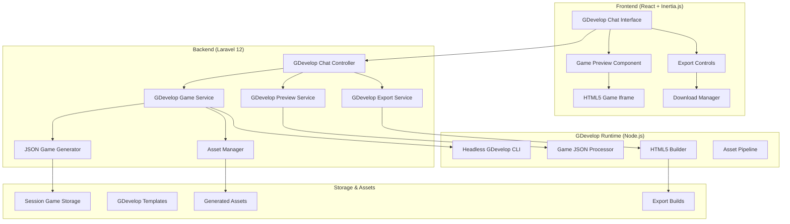
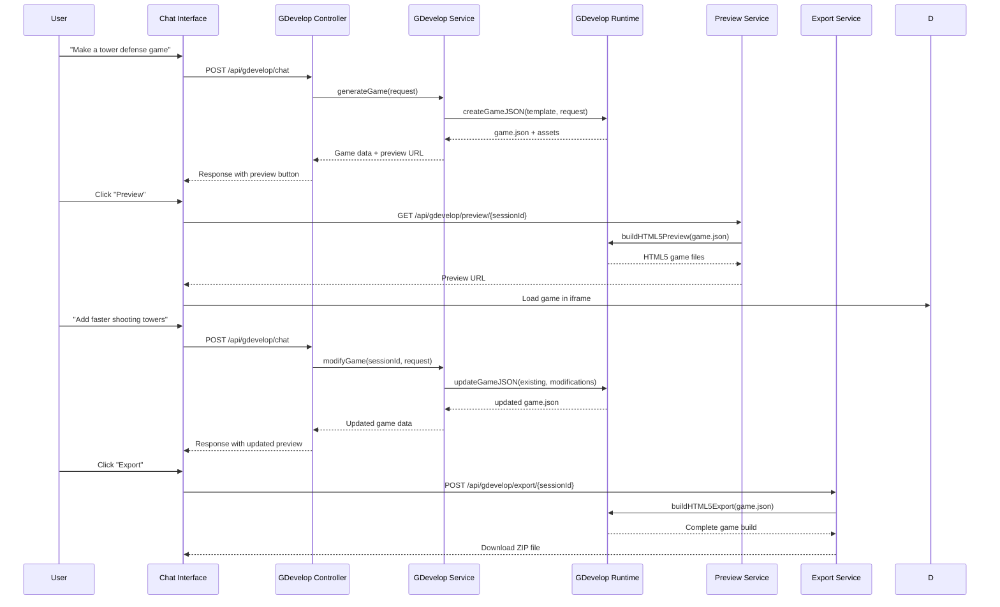

# Design Document

## Overview

The GDevelop Chat Integration will add a new game engine to SurrealPilot, enabling users to create and iterate on GDevelop games through an AI-powered chat interface. The system will leverage GDevelop's open-source runtime and CLI tools to generate, modify, and preview games entirely through terminal commands without requiring the GDevelop GUI.

The design follows SurrealPilot's existing architecture patterns using Laravel 12 + Inertia.js + React while adding GDevelop-specific services for JSON game generation, headless runtime management, and HTML5 export capabilities. The integration will be modular and configurable, allowing it to work alongside existing Unreal Engine and PlayCanvas support.

## Architecture

### High-Level System Architecture



### Component Interaction Flow



## Components and Interfaces

### Frontend Components

#### 1. GDevelop Chat Interface Component
```typescript
interface GDevelopChatProps {
  workspaceId: string;
  sessionId: string;
  onGameGenerated: (gameData: GDevelopGameData) => void;
  onPreviewReady: (previewUrl: string) => void;
}

interface GDevelopGameData {
  sessionId: string;
  gameJson: any;
  assets: GameAsset[];
  previewUrl?: string;
  lastModified: string;
  version: number;
}

interface GameAsset {
  name: string;
  type: 'sprite' | 'sound' | 'font' | 'texture';
  path: string;
  size: number;
}
```

#### 2. GDevelop Game Preview Component
```typescript
interface GDevelopPreviewProps {
  gameData: GDevelopGameData;
  previewUrl: string;
  onExport: () => void;
  onRefresh: () => void;
}

interface PreviewState {
  loading: boolean;
  error: string | null;
  gameLoaded: boolean;
  performance: {
    loadTime: number;
    fps: number;
    memoryUsage: number;
  };
}
```

#### 3. GDevelop Export Component
```typescript
interface GDevelopExportProps {
  sessionId: string;
  gameData: GDevelopGameData;
  onExportComplete: (downloadUrl: string) => void;
  onExportError: (error: string) => void;
}

interface ExportOptions {
  includeAssets: boolean;
  optimizeForMobile: boolean;
  compressionLevel: 'none' | 'standard' | 'maximum';
  exportFormat: 'html5' | 'cordova' | 'electron';
}
```

### Backend Services

#### 1. GDevelop Chat Controller
```php
class GDevelopChatController extends Controller
{
    public function __construct(
        private GDevelopGameService $gameService,
        private GDevelopPreviewService $previewService,
        private GDevelopExportService $exportService,
        private SessionManager $sessionManager
    ) {}

    public function chat(GDevelopChatRequest $request): JsonResponse
    {
        // Process chat request and generate/modify game
        // Return game data with preview URL
    }

    public function preview(string $sessionId): JsonResponse
    {
        // Generate HTML5 preview for current game state
    }

    public function export(string $sessionId, ExportGameRequest $request): JsonResponse
    {
        // Create downloadable ZIP export
    }
}
```

#### 2. GDevelop Game Service
```php
class GDevelopGameService
{
    public function createGame(
        string $sessionId,
        string $userRequest,
        ?array $template = null
    ): GDevelopGameData {
        // Generate initial game.json from template
        // Process user request with AI
        // Save game state to session storage
    }

    public function modifyGame(
        string $sessionId,
        string $userRequest
    ): GDevelopGameData {
        // Load existing game.json
        // Apply AI-generated modifications
        // Validate JSON structure
        // Save updated game state
    }

    public function validateGameJson(array $gameJson): ValidationResult
    {
        // Validate against GDevelop schema
        // Check for required properties
        // Verify object relationships
    }
}
```

#### 3. GDevelop Runtime Service
```php
class GDevelopRuntimeService
{
    public function buildPreview(string $sessionId): PreviewResult
    {
        // Execute GDevelop CLI commands
        // Generate HTML5 preview files
        // Return preview URL
    }

    public function buildExport(string $sessionId, array $options = []): ExportResult
    {
        // Execute GDevelop export CLI
        // Create ZIP package
        // Return download URL
    }

    public function executeGDevelopCommand(array $command): CommandResult
    {
        // Execute headless GDevelop CLI commands
        // Handle stdout/stderr
        // Return execution results
    }
}
```

#### 4. GDevelop AI Service
```php
class GDevelopAIService
{
    public function generateGameFromRequest(
        string $userRequest,
        ?array $existingGame = null
    ): array {
        // Process natural language request
        // Generate GDevelop JSON structure
        // Include objects, scenes, events, behaviors
    }

    public function modifyGameFromRequest(
        string $userRequest,
        array $currentGame
    ): array {
        // Analyze existing game structure
        // Apply requested modifications
        // Preserve existing elements
    }

    public function generateGDevelopEvents(
        string $gameLogic,
        array $gameObjects
    ): array {
        // Convert logic description to GDevelop events
        // Create conditions and actions
        // Link to appropriate objects
    }
}
```

## Data Models

### GDevelop Game Session Model
```php
class GDevelopGameSession extends Model
{
    protected $fillable = [
        'workspace_id',
        'user_id',
        'session_id',
        'game_title',
        'game_json',
        'assets_manifest',
        'version',
        'last_modified',
        'preview_url',
        'export_url',
        'status',
        'error_log',
    ];

    protected $casts = [
        'game_json' => 'array',
        'assets_manifest' => 'array',
        'last_modified' => 'datetime',
    ];
}
```

### GDevelop Game JSON Structure
```typescript
interface GDevelopGame {
  properties: GameProperties;
  resources: GameResource[];
  objects: GameObject[];
  objectsGroups: ObjectGroup[];
  variables: Variable[];
  layouts: Layout[];
  externalEvents: ExternalEvent[];
  eventsFunctionsExtensions: Extension[];
  externalLayouts: ExternalLayout[];
  externalSourceFiles: SourceFile[];
}

interface GameProperties {
  name: string;
  description: string;
  author: string;
  version: string;
  orientation: 'default' | 'landscape' | 'portrait';
  sizeOnStartupMode: 'adaptWidth' | 'adaptHeight' | 'noChanges';
  adaptGameResolutionAtRuntime: boolean;
  antialiasingMode: 'MSAA' | 'none';
  pixelsRounding: boolean;
  projectUuid: string;
}

interface Layout {
  name: string;
  mangledName: string;
  r: number;
  v: number;
  b: number;
  associatedLayout: string;
  standardSortMethod: boolean;
  stopSoundsOnStartup: boolean;
  title: string;
  behaviorsSharedData: BehaviorSharedData[];
  objects: LayoutObject[];
  layers: Layer[];
  behaviorsSharedData: BehaviorSharedData[];
}
```

## Error Handling

### Error Types and Recovery Strategies

#### 1. GDevelop CLI Errors
```php
class GDevelopCliException extends Exception
{
    public function __construct(
        string $message,
        public readonly string $command,
        public readonly string $stdout,
        public readonly string $stderr,
        public readonly int $exitCode,
        ?\Throwable $previous = null
    ) {
        parent::__construct($message, $exitCode, $previous);
    }
}
```

#### 2. Game JSON Validation Errors
```php
class GameJsonValidationException extends Exception
{
    public function __construct(
        string $message,
        public readonly array $validationErrors,
        public readonly array $gameJson,
        ?\Throwable $previous = null
    ) {
        parent::__construct($message, 0, $previous);
    }
}
```

#### 3. Preview Generation Errors
- **CLI Command Failures**: Retry with fallback parameters
- **Asset Loading Issues**: Use default assets and notify user
- **Runtime Errors**: Provide debugging information and recovery options

#### 4. Export Process Errors
- **Build Failures**: Show detailed error logs and suggestions
- **ZIP Creation Issues**: Retry with different compression settings
- **File Permission Problems**: Automatic permission correction

### Error Recovery Mechanisms
```typescript
interface ErrorRecovery {
  errorType: 'cli' | 'validation' | 'preview' | 'export';
  retryCount: number;
  maxRetries: number;
  fallbackStrategy: string;
  userMessage: string;
  debugInfo?: any;
}
```

## Testing Strategy

### Unit Tests
- **GDevelopGameService**: Test game creation and modification logic
- **GDevelopRuntimeService**: Test CLI command execution and result parsing
- **GDevelopAIService**: Test natural language to JSON conversion
- **Game JSON Validation**: Test schema validation and error handling

### Integration Tests
- **Complete Chat Workflow**: Test end-to-end game creation through chat
- **Preview Generation**: Test HTML5 preview creation and serving
- **Export Process**: Test ZIP export generation and download
- **Session Management**: Test game state persistence and recovery

### Browser Tests (Pest Browser Testing)
```php
test('user can create GDevelop game through chat', function () {
    // Test game creation workflow
    // Verify preview functionality
    // Test export capabilities
    // Validate mobile responsiveness
});

test('GDevelop games work on mobile devices', function () {
    // Test touch controls
    // Verify responsive design
    // Test performance on mobile
});
```

### CLI Integration Tests
```php
test('GDevelop CLI commands execute correctly', function () {
    // Test headless GDevelop installation
    // Verify preview generation
    // Test export functionality
    // Validate file outputs
});
```

## Security Considerations

### Game Content Security
- **JSON Sanitization**: Validate all game JSON against schema
- **Asset Validation**: Ensure safe asset file handling
- **Code Injection Prevention**: Sanitize user inputs in game logic

### File System Security
- **Sandboxed Execution**: Isolate GDevelop CLI execution
- **Path Traversal Prevention**: Validate all file paths
- **Resource Limits**: Prevent excessive disk/memory usage

### Session Security
- **Session Isolation**: Ensure complete separation between user sessions
- **Access Control**: Validate session ownership
- **Cleanup Procedures**: Secure deletion of temporary files

## Performance Optimization

### Frontend Optimization
- **Lazy Loading**: Load GDevelop components only when needed
- **Preview Caching**: Cache generated previews for faster loading
- **Asset Optimization**: Compress and optimize game assets

### Backend Optimization
- **CLI Process Pooling**: Reuse GDevelop CLI processes when possible
- **JSON Caching**: Cache validated game JSON structures
- **Async Processing**: Use queues for long-running export operations

### GDevelop Runtime Optimization
- **Template Caching**: Cache common game templates
- **Incremental Builds**: Only rebuild changed components
- **Asset Pipeline**: Optimize asset processing and compression

## Deployment Considerations

### GDevelop CLI Installation
```bash
# Install GDevelop CLI via npm
npm install -g gdevelop-cli

# Verify installation
gdevelop-cli --version

# Setup headless environment
export DISPLAY=:99
Xvfb :99 -screen 0 1024x768x24 &
```

### Infrastructure Requirements
- **Node.js Runtime**: Version 16+ for GDevelop CLI
- **Storage**: Additional space for game files and exports
- **Memory**: Sufficient RAM for concurrent game builds
- **CPU**: Multi-core support for parallel processing

### Environment Configuration
```env
# GDevelop Configuration
GDEVELOP_CLI_PATH=/usr/local/bin/gdevelop-cli
GDEVELOP_TEMPLATES_PATH=/storage/gdevelop/templates
GDEVELOP_SESSIONS_PATH=/storage/gdevelop/sessions
GDEVELOP_EXPORTS_PATH=/storage/gdevelop/exports
GDEVELOP_MAX_SESSION_SIZE=100MB
GDEVELOP_SESSION_TIMEOUT=24h

# Feature Flags
GDEVELOP_ENABLED=true
PLAYCANVAS_ENABLED=false
```

### Monitoring and Analytics
- **Build Success Rates**: Track game generation and export success
- **Performance Metrics**: Monitor preview generation times
- **User Engagement**: Track chat interactions and game complexity
- **Error Tracking**: Monitor CLI failures and recovery rates

### Scalability Planning
- **Horizontal Scaling**: Support for multiple GDevelop CLI instances
- **Load Balancing**: Distribute game builds across servers
- **Caching Strategy**: Redis caching for game templates and assets
- **CDN Integration**: Fast delivery of generated games and exports