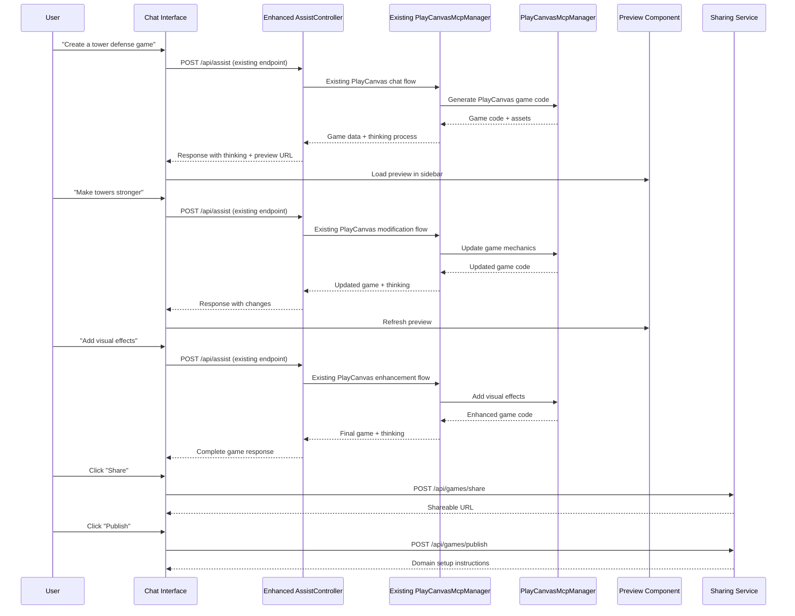

# Design Document

## Overview

The Enhanced PlayCanvas Chat Experience will extend SurrealPilot's existing PlayCanvas integration with real-time preview functionality, game sharing capabilities, and custom domain publishing. The system will leverage the existing Laravel 12 + Inertia.js + React architecture while adding components for AI thinking display, sidebar preview with fullscreen support, one-click sharing, and guided domain publishing.

The design follows the open-lovable approach of exposing AI thinking processes, creating an engaging and educational development experience. Users will interact through the enhanced existing PlayCanvas chat interface, which will be tested by creating a Tower Defense game to demonstrate all new capabilities.

## Architecture

### High-Level System Architecture

```mermaid
graph TB
    subgraph "Frontend (React + Inertia.js)"
        A[Enhanced Chat Interface] --> B[AI Thinking Display]
        A --> C[Game Preview Sidebar]
        C --> D[Fullscreen Game View]
        C --> E[Share/Publish Controls]
    end
    
    subgraph "Backend (Laravel 12)"
        F[Enhanced AssistController] --> G[Existing PlayCanvasMcpManager]
        F --> H[GameSharingService]
        F --> I[DomainPublishingService]
        F --> J[Enhanced GameStorageService]
    end
    
    subgraph "Storage & Assets"
        L[Game Files Storage]
        M[Shared Games Storage]
        N[Domain Mapping Config]
    end
    
    subgraph "External Services"
        O[PlayCanvas MCP Server]
        P[DNS Configuration]
        Q[Web Server (Nginx/Apache)]
    end
    
    A --> F
    H --> O
    I --> M
    J --> P
    J --> Q
    G --> L
```

### Component Interaction Flow



## Components and Interfaces

### Frontend Components

#### 1. TowerDefenseChatInterface Component
```typescript
interface TowerDefenseChatProps {
  workspaceId: string;
  conversationId?: string;
  onGameGenerated: (gameData: GameData) => void;
  onThinkingUpdate: (thinking: ThinkingProcess) => void;
}

interface ThinkingProcess {
  step: string;
  reasoning: string;
  decisions: string[];
  implementation: string;
  timestamp: string;
}

interface GameData {
  id: string;
  title: string;
  previewUrl: string;
  code: string;
  assets: GameAsset[];
  mechanics: GameMechanics;
  interactionCount: number;
}
```

#### 2. GamePreviewSidebar Component
```typescript
interface GamePreviewProps {
  gameData: GameData;
  isFullscreen: boolean;
  onFullscreenToggle: () => void;
  onShare: () => void;
  onPublish: () => void;
}

interface GamePreviewState {
  loading: boolean;
  error: string | null;
  gameState: any;
  performance: PerformanceMetrics;
}
```

#### 3. AIThinkingDisplay Component
```typescript
interface AIThinkingProps {
  thinking: ThinkingProcess;
  isVisible: boolean;
  onToggle: () => void;
}

interface ThinkingStep {
  title: string;
  content: string;
  type: 'analysis' | 'decision' | 'implementation' | 'validation';
  duration: number;
}
```

#### 4. GameSharingModal Component
```typescript
interface GameSharingProps {
  game: GameData;
  onShare: (options: SharingOptions) => Promise<ShareResult>;
  onPublish: (options: PublishingOptions) => Promise<PublishResult>;
}

interface SharingOptions {
  allowEmbedding: boolean;
  showControls: boolean;
  showInfo: boolean;
  expirationDays?: number;
}

interface PublishingOptions {
  customDomain?: string;
  subdirectory?: string;
  sslEnabled: boolean;
}
```

### Backend Services

#### 1. TowerDefenseController
```php
class TowerDefenseController extends Controller
{
    public function __construct(
        private GameGenerationService $gameGenerator,
        private GameSharingService $sharingService,
        private DomainPublishingService $publishingService,
        private ConversationContextService $contextService
    ) {}

    public function chat(TowerDefenseRequest $request): JsonResponse
    {
        // Handle multi-step TD game creation
        // Return thinking process + game updates
    }

    public function share(Game $game, ShareGameRequest $request): JsonResponse
    {
        // Generate shareable link
    }

    public function publish(Game $game, PublishGameRequest $request): JsonResponse
    {
        // Setup custom domain publishing
    }
}
```

#### 2. GameGenerationService
```php
class GameGenerationService
{
    public function initiateTDConversation(
        Workspace $workspace,
        string $userInput,
        ?ChatConversation $conversation = null
    ): TDGameResponse {
        // Start multi-step TD game creation
        // Generate thinking process
        // Create initial game structure
    }

    public function processGameModification(
        Game $game,
        string $userInput,
        int $interactionStep
    ): TDGameResponse {
        // Process user feedback
        // Update game mechanics
        // Generate thinking explanation
    }

    public function generateThinkingProcess(
        string $userInput,
        array $gameState,
        string $action
    ): ThinkingProcess {
        // Create detailed thinking explanation
        // Show AI decision-making process
    }
}
```

#### 3. GameSharingService
```php
class GameSharingService
{
    public function createShareableLink(
        Game $game,
        array $options = []
    ): ShareResult {
        // Generate unique share token
        // Create public game snapshot
        // Return shareable URL
    }

    public function getSharedGame(string $shareToken): ?Game
    {
        // Retrieve game by share token
        // Validate access permissions
    }
}
```

#### 4. DomainPublishingService
```php
class DomainPublishingService
{
    public function setupCustomDomain(
        Game $game,
        string $domain
    ): PublishResult {
        // Validate domain format
        // Create DNS mapping configuration
        // Setup web server virtual host
        // Return setup instructions
    }

    public function generateDNSInstructions(string $domain): array
    {
        // Return DNS A record configuration
        // Include SERVER_IP from environment
    }
}
```

## Data Models

### Enhanced Game Model
```php
class Game extends Model
{
    protected $fillable = [
        'workspace_id',
        'conversation_id',
        'title',
        'description',
        'engine_type',
        'template_id',
        'status',
        'share_token',
        'published_url',
        'custom_domain',
        'is_public',
        'interaction_count',
        'thinking_history',
        'game_mechanics',
        'sharing_settings',
        'published_at',
        'last_played_at',
        'play_count',
    ];

    protected $casts = [
        'thinking_history' => 'array',
        'game_mechanics' => 'array',
        'sharing_settings' => 'array',
        'published_at' => 'datetime',
        'last_played_at' => 'datetime',
    ];
}
```

### TowerDefenseGameData Structure
```php
interface TowerDefenseGameData
{
    public string $id;
    public string $title;
    public string $description;
    public array $towers;
    public array $enemies;
    public array $waves;
    public array $map;
    public GameSettings $settings;
    public int $interactionCount;
    public array $thinkingHistory;
}

interface GameSettings
{
    public int $startingHealth;
    public int $startingCurrency;
    public float $gameSpeed;
    public bool $allowPausing;
    public array $difficulty;
}
```

## Error Handling

### Error Types and Recovery Strategies

#### 1. Game Generation Errors
```php
class GameGenerationException extends Exception
{
    public function __construct(
        string $message,
        public readonly string $step,
        public readonly array $context = [],
        ?\Throwable $previous = null
    ) {
        parent::__construct($message, 0, $previous);
    }
}
```

#### 2. Preview Loading Errors
- **Network Issues**: Retry with exponential backoff
- **Code Compilation Errors**: Show detailed error messages with suggestions
- **Asset Loading Failures**: Fallback to default assets

#### 3. Sharing/Publishing Errors
- **DNS Configuration Issues**: Provide step-by-step troubleshooting
- **Domain Validation Failures**: Clear error messages with correction suggestions
- **Storage Failures**: Automatic retry with user notification

### Error Recovery Mechanisms
```typescript
interface ErrorRecovery {
  retryCount: number;
  maxRetries: number;
  backoffStrategy: 'linear' | 'exponential';
  fallbackAction?: () => void;
  userNotification: string;
}
```

## Testing Strategy

### Unit Tests
- **GameGenerationService**: Test TD game creation logic
- **ConversationContextService**: Test multi-step conversation handling
- **GameSharingService**: Test share link generation and validation
- **DomainPublishingService**: Test DNS configuration generation

### Integration Tests
- **Complete Chat Flow**: Test 3+ interaction TD game creation
- **Preview Functionality**: Test real-time game preview updates
- **Sharing Workflow**: Test end-to-end sharing process
- **Publishing Workflow**: Test custom domain setup process

### Browser Tests (Pest Browser Testing)
```php
test('user can create tower defense game through chat', function () {
    // Test complete 3-interaction flow
    // Verify preview updates
    // Test fullscreen functionality
    // Verify sharing capabilities
});

test('mobile users can play shared games', function () {
    // Test mobile responsiveness
    // Verify touch controls
    // Test performance on mobile
});
```

### Performance Tests
- **Preview Load Time**: < 2 seconds
- **Game Generation**: < 5 seconds per interaction
- **Share Link Creation**: < 3 seconds
- **Mobile Performance**: 60fps on modern devices

## Security Considerations

### Game Content Security
- **Code Sanitization**: Validate all generated game code
- **Asset Validation**: Ensure safe asset handling
- **XSS Prevention**: Sanitize user inputs and generated content

### Sharing Security
- **Access Control**: Validate share token permissions
- **Rate Limiting**: Prevent abuse of sharing endpoints
- **Content Moderation**: Basic checks for inappropriate content

### Domain Publishing Security
- **Domain Validation**: Verify domain ownership
- **DNS Security**: Prevent DNS hijacking attempts
- **SSL Configuration**: Ensure secure connections

## Performance Optimization

### Frontend Optimization
- **Code Splitting**: Lazy load TD-specific components
- **Preview Caching**: Cache game previews for faster loading
- **Mobile Optimization**: Optimize for touch devices and slower networks

### Backend Optimization
- **Game Generation Caching**: Cache common TD templates and components
- **Database Indexing**: Optimize queries for game retrieval
- **Asset Compression**: Compress game assets for faster delivery

### Real-time Updates
- **WebSocket Integration**: Real-time preview updates
- **Server-Sent Events**: Stream thinking process updates
- **Optimistic Updates**: Update UI before server confirmation

## Deployment Considerations

### Infrastructure Requirements
- **Storage**: Additional space for game files and shared content
- **CDN**: Fast delivery of game assets and shared games
- **DNS Management**: Automated DNS configuration for custom domains

### Monitoring and Analytics
- **Game Creation Metrics**: Track success rates and completion times
- **Performance Monitoring**: Monitor preview load times and game performance
- **User Engagement**: Track interaction patterns and game sharing

### Scalability Planning
- **Horizontal Scaling**: Support for multiple game generation workers
- **Database Sharding**: Partition game data by workspace/company
- **CDN Integration**: Global distribution of shared games