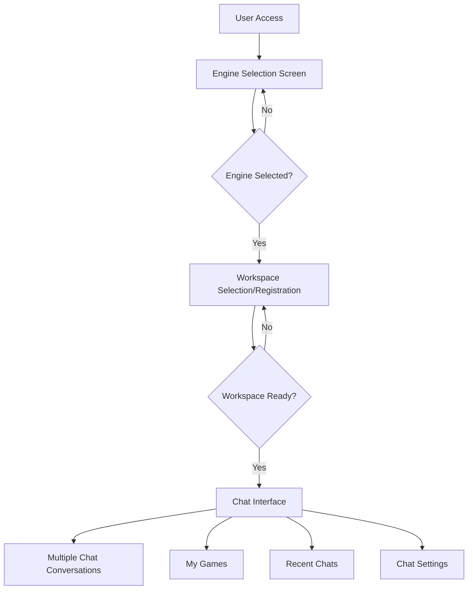

# Design Document

## Overview

The Interface Redesign and Testing feature will transform the Surreal Pilot user experience by implementing a structured workflow that begins with engine selection, followed by workspace registration, and then enables multi-chat functionality per workspace. This design ensures proper engine-specific configuration while maintaining backward compatibility and includes comprehensive end-to-end testing using Puppeteer MCP to validate all functionality.

The redesign introduces a clear separation of concerns between engine selection, workspace management, and chat functionality, while preserving existing API endpoints and data structures. The system will support both PlayCanvas and Unreal Engine workflows with proper isolation and validation.

## Architecture

### Frontend Architecture

The frontend will be restructured into three main phases:

1. **Engine Selection Phase**: Initial screen for choosing development engine
2. **Workspace Management Phase**: Registration and selection of workspaces
3. **Chat Interface Phase**: Multi-chat functionality within selected workspace



### Backend Architecture

The backend will extend existing models and controllers to support the new workflow:

-   **Engine Selection Service**: Manages engine type persistence and validation
-   **Workspace Management Service**: Enhanced workspace creation and selection
-   **Chat Conversation Service**: New service for managing multiple chats per workspace
-   **Game Storage Service**: Enhanced game metadata and retrieval
-   **Testing Service**: Puppeteer MCP integration for automated testing

### Database Schema Extensions

New tables and modifications to support multi-chat functionality:

```sql
-- New table for chat conversations
CREATE TABLE chat_conversations (
    id BIGINT UNSIGNED AUTO_INCREMENT PRIMARY KEY,
    workspace_id BIGINT UNSIGNED NOT NULL,
    title VARCHAR(255) NULL,
    description TEXT NULL,
    created_at TIMESTAMP NULL DEFAULT NULL,
    updated_at TIMESTAMP NULL DEFAULT NULL,
    FOREIGN KEY (workspace_id) REFERENCES workspaces(id) ON DELETE CASCADE,
    INDEX idx_workspace_conversations (workspace_id, updated_at DESC)
);

-- New table for chat messages
CREATE TABLE chat_messages (
    id BIGINT UNSIGNED AUTO_INCREMENT PRIMARY KEY,
    conversation_id BIGINT UNSIGNED NOT NULL,
    role ENUM('user', 'assistant', 'system') NOT NULL,
    content LONGTEXT NOT NULL,
    metadata JSON NULL,
    created_at TIMESTAMP NULL DEFAULT NULL,
    FOREIGN KEY (conversation_id) REFERENCES chat_conversations(id) ON DELETE CASCADE,
    INDEX idx_conversation_messages (conversation_id, created_at ASC)
);

-- New table for games metadata
CREATE TABLE games (
    id BIGINT UNSIGNED AUTO_INCREMENT PRIMARY KEY,
    workspace_id BIGINT UNSIGNED NOT NULL,
    conversation_id BIGINT UNSIGNED NULL,
    title VARCHAR(255) NOT NULL,
    description TEXT NULL,
    preview_url VARCHAR(500) NULL,
    published_url VARCHAR(500) NULL,
    thumbnail_url VARCHAR(500) NULL,
    metadata JSON NULL,
    created_at TIMESTAMP NULL DEFAULT NULL,
    updated_at TIMESTAMP NULL DEFAULT NULL,
    FOREIGN KEY (workspace_id) REFERENCES workspaces(id) ON DELETE CASCADE,
    FOREIGN KEY (conversation_id) REFERENCES chat_conversations(id) ON DELETE SET NULL,
    INDEX idx_workspace_games (workspace_id, updated_at DESC)
);

-- Add session storage for engine selection
ALTER TABLE users ADD COLUMN selected_engine_type VARCHAR(50) NULL;
```

## Components and Interfaces

### Frontend Components

#### 1. Engine Selection Component

```typescript
interface EngineSelectionProps {
    onEngineSelected: (engineType: "playcanvas" | "unreal") => void;
    availableEngines: EngineOption[];
}

interface EngineOption {
    type: "playcanvas" | "unreal";
    name: string;
    description: string;
    icon: string;
    features: string[];
}
```

#### 2. Workspace Management Component

```typescript
interface WorkspaceManagerProps {
    engineType: "playcanvas" | "unreal";
    onWorkspaceSelected: (workspace: Workspace) => void;
    existingWorkspaces: Workspace[];
}

interface WorkspaceRegistrationForm {
    name: string;
    description: string;
    engineType: "playcanvas" | "unreal";
    templateId?: number;
}
```

#### 3. Multi-Chat Interface Component

```typescript
interface MultiChatInterfaceProps {
    workspace: Workspace;
    conversations: ChatConversation[];
    activeConversationId: number | null;
    onConversationSelect: (conversationId: number) => void;
    onNewConversation: () => void;
}

interface ChatConversation {
    id: number;
    title: string | null;
    description: string | null;
    lastMessage: string;
    lastActivity: Date;
    messageCount: number;
}
```

#### 4. Recent Chats Component

```typescript
interface RecentChatsProps {
    conversations: ChatConversation[];
    onConversationSelect: (conversationId: number) => void;
    onConversationDelete: (conversationId: number) => void;
}
```

#### 5. My Games Component

```typescript
interface MyGamesProps {
    games: Game[];
    onGameSelect: (gameId: number) => void;
    onGameDelete: (gameId: number) => void;
}

interface Game {
    id: number;
    title: string;
    description: string | null;
    thumbnailUrl: string | null;
    previewUrl: string | null;
    publishedUrl: string | null;
    createdAt: Date;
    updatedAt: Date;
}
```

#### 6. Chat Settings Component

```typescript
interface ChatSettingsProps {
    currentSettings: ChatSettings;
    availableModels: AIModel[];
    onSettingsSave: (settings: ChatSettings) => void;
}

interface ChatSettings {
    aiModel: string;
    temperature: number;
    maxTokens: number;
    streamingEnabled: boolean;
}

interface AIModel {
    id: string;
    name: string;
    provider: string;
    description: string;
    available: boolean;
}
```

### Backend Services

#### 1. Engine Selection Service

```php
class EngineSelectionService
{
    public function getAvailableEngines(): array;
    public function setUserEnginePreference(User $user, string $engineType): void;
    public function getUserEnginePreference(User $user): ?string;
    public function validateEngineType(string $engineType): bool;
}
```

#### 2. Chat Conversation Service

```php
class ChatConversationService
{
    public function createConversation(Workspace $workspace, ?string $title = null): ChatConversation;
    public function getWorkspaceConversations(Workspace $workspace): Collection;
    public function getConversationMessages(ChatConversation $conversation): Collection;
    public function addMessage(ChatConversation $conversation, string $role, string $content, ?array $metadata = null): ChatMessage;
    public function updateConversationActivity(ChatConversation $conversation): void;
    public function deleteConversation(ChatConversation $conversation): bool;
}
```

#### 3. Game Storage Service

```php
class GameStorageService
{
    public function createGame(Workspace $workspace, string $title, ?ChatConversation $conversation = null): Game;
    public function getWorkspaceGames(Workspace $workspace): Collection;
    public function updateGameMetadata(Game $game, array $metadata): Game;
    public function generateThumbnail(Game $game): ?string;
    public function deleteGame(Game $game): bool;
}
```

#### 4. Puppeteer Testing Integration

The Puppeteer MCP server is already configured and available. The testing integration will utilize the existing MCP server to:

-   Execute comprehensive end-to-end tests
-   Validate the complete user journey
-   Test authentication flows with provided credentials
-   Verify all interface components and navigation
-   Ensure cross-engine compatibility
-   Validate game creation and storage workflows

````

### API Endpoints

#### New Endpoints
```php
// Engine Selection
GET /api/engines - Get available engines
POST /api/user/engine-preference - Set user engine preference
GET /api/user/engine-preference - Get user engine preference

// Chat Conversations
GET /api/workspaces/{id}/conversations - Get workspace conversations
POST /api/workspaces/{id}/conversations - Create new conversation
GET /api/conversations/{id}/messages - Get conversation messages
POST /api/conversations/{id}/messages - Add message to conversation
PUT /api/conversations/{id} - Update conversation details
DELETE /api/conversations/{id} - Delete conversation

// Games Management
GET /api/workspaces/{id}/games - Get workspace games
POST /api/workspaces/{id}/games - Create new game
GET /api/games/{id} - Get game details
PUT /api/games/{id} - Update game metadata
DELETE /api/games/{id} - Delete game

// Chat Settings
GET /api/chat/settings - Get user chat settings
POST /api/chat/settings - Save chat settings
GET /api/chat/models - Get available AI models

// Testing Integration (using existing Puppeteer MCP server)
// Tests will be executed via MCP commands to the existing Puppeteer server
````

#### Enhanced Existing Endpoints

```php
// Enhanced workspace creation with engine validation
POST /api/prototype - Enhanced to validate engine compatibility

// Enhanced chat endpoint with conversation context
POST /api/chat - Enhanced to support conversation_id parameter

// Enhanced assist endpoint with conversation context
POST /api/assist - Enhanced to support conversation_id parameter
```

## Data Models

### New Models

#### ChatConversation Model

```php
class ChatConversation extends Model
{
    protected $fillable = ['workspace_id', 'title', 'description'];

    public function workspace(): BelongsTo;
    public function messages(): HasMany;
    public function games(): HasMany;
    public function getLastMessage(): ?ChatMessage;
    public function getMessageCount(): int;
    public function updateActivity(): void;
}
```

#### ChatMessage Model

```php
class ChatMessage extends Model
{
    protected $fillable = ['conversation_id', 'role', 'content', 'metadata'];
    protected $casts = ['metadata' => 'array'];

    public function conversation(): BelongsTo;
    public function isFromUser(): bool;
    public function isFromAssistant(): bool;
}
```

#### Game Model

```php
class Game extends Model
{
    protected $fillable = [
        'workspace_id', 'conversation_id', 'title', 'description',
        'preview_url', 'published_url', 'thumbnail_url', 'metadata'
    ];
    protected $casts = ['metadata' => 'array'];

    public function workspace(): BelongsTo;
    public function conversation(): BelongsTo;
    public function generateThumbnail(): ?string;
    public function isPublished(): bool;
}
```

### Enhanced Existing Models

#### User Model Enhancement

```php
// Add engine preference tracking
protected $fillable = [..., 'selected_engine_type'];

public function getSelectedEngineType(): ?string;
public function setEnginePreference(string $engineType): void;
```

#### Workspace Model Enhancement

```php
// Add conversation relationship
public function conversations(): HasMany;
public function games(): HasMany;
public function getActiveConversations(): Collection;
public function getRecentGames(): Collection;
```

## Error Handling

### Engine Selection Errors

-   Invalid engine type selection
-   Engine not available for user's plan
-   Engine configuration missing

### Workspace Registration Errors

-   Duplicate workspace names
-   Invalid engine type for workspace
-   Template incompatibility with selected engine
-   MCP server initialization failures

### Chat Conversation Errors

-   Conversation not found
-   Unauthorized access to conversation
-   Message validation failures
-   Cross-engine command attempts

### Game Storage Errors

-   Game creation failures
-   Thumbnail generation errors
-   Storage quota exceeded
-   Invalid game metadata

### Testing Errors

-   Puppeteer initialization failures
-   Authentication errors during testing
-   Test timeout errors
-   Environment setup issues

## Testing Strategy

### Unit Tests

-   Engine selection service validation
-   Chat conversation CRUD operations
-   Game storage and retrieval
-   Model relationships and constraints
-   API endpoint validation

### Integration Tests

-   End-to-end engine selection flow
-   Workspace registration with different engines
-   Multi-chat conversation management
-   Game creation and storage workflow
-   Settings persistence and retrieval

### Puppeteer MCP Tests

```javascript
// Test suite structure
describe("Full Application Flow", () => {
    test("Engine Selection and Workspace Registration");
    test("PlayCanvas Game Creation and Storage");
    test("Chat Conversation Management");
    test("Recent Chats Functionality");
    test("My Games Management");
    test("Chat Settings with AI_MODEL_PLAYCANVAS");
    test("Header Navigation Links");
    test("Authentication Flow");
    test("Cross-Engine Compatibility");
});
```

### Test Data Management

-   Automated test user creation
-   Workspace cleanup after tests
-   Game asset cleanup
-   Conversation history management
-   Test environment isolation

### Continuous Testing

-   Automated test execution on code changes
-   Test failure notification system
-   Automatic issue detection and reporting
-   Performance regression testing
-   Mobile compatibility testing

## Security Considerations

### Authentication and Authorization

-   Engine selection requires authenticated user
-   Workspace access validation
-   Conversation ownership verification
-   Game access control
-   Settings modification permissions

### Data Validation

-   Engine type validation
-   Workspace name sanitization
-   Chat message content validation
-   Game metadata validation
-   Settings value validation

### Cross-Engine Security

-   Prevent cross-engine command execution
-   Validate engine-specific permissions
-   Isolate engine-specific data
-   Secure MCP server communication
-   Validate workspace engine compatibility

## Performance Considerations

### Database Optimization

-   Proper indexing for conversation queries
-   Efficient game listing queries
-   Optimized recent chats retrieval
-   Workspace-scoped query optimization
-   Message pagination for large conversations

### Frontend Performance

-   Lazy loading of conversation history
-   Efficient game thumbnail loading
-   Optimized chat interface rendering
-   Proper state management
-   Mobile performance optimization

### Testing Performance

-   Parallel test execution
-   Efficient test data setup
-   Optimized Puppeteer operations
-   Test result caching
-   Resource cleanup optimization

## Migration Strategy

### Database Migrations

1. Create new tables for conversations, messages, and games
2. Add engine preference column to users table
3. Create necessary indexes for performance
4. Migrate existing chat data to new structure
5. Update foreign key constraints

### Frontend Migration

1. Implement engine selection screen
2. Update workspace management interface
3. Replace single chat with multi-chat interface
4. Add Recent Chats and My Games sections
5. Enhance Chat Settings with new options

### Backend Migration

1. Create new service classes
2. Add new API endpoints
3. Enhance existing controllers
4. Update middleware for conversation context
5. Implement Puppeteer testing integration

### Data Migration

1. Preserve existing workspace data
2. Create default conversations for existing workspaces
3. Migrate existing game data to new structure
4. Update user preferences
5. Validate data integrity after migration

## Deployment Strategy

### Staging Deployment

1. Deploy database migrations
2. Deploy backend changes
3. Deploy frontend changes
4. Run comprehensive test suite
5. Validate all functionality

### Production Deployment

1. Schedule maintenance window
2. Deploy database migrations
3. Deploy application code
4. Run post-deployment tests
5. Monitor system performance
6. Rollback plan if issues detected

### Post-Deployment Validation

1. Run full Puppeteer test suite
2. Validate all user flows
3. Check performance metrics
4. Monitor error rates
5. Verify data integrity
