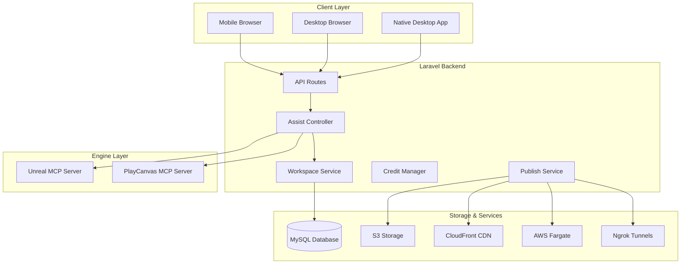

# Design Document

## Overview

The PlayCanvas Integration extends Surreal Pilot's existing Unreal Engine capabilities by adding a parallel track for mobile-first game prototyping using the open-source PlayCanvas engine. The design maintains complete separation from existing Unreal Engine functionality while leveraging the same underlying infrastructure for credits, authentication, and AI assistance.

The integration follows a microservices approach where PlayCanvas workspaces operate independently through their own MCP server instances, while sharing the same Laravel backend for user management, billing, and AI routing.

## Architecture

### High-Level Architecture



### Engine Detection and Routing

The system uses a workspace-based approach where each workspace is tagged with an engine type (`unreal` or `playcanvas`). The AssistController routes requests to the appropriate MCP server based on the workspace's engine type.

### Data Flow

1. **Prototype Creation**: User selects template → System clones demo → Creates workspace with PlayCanvas MCP server
2. **Chat Assistance**: User sends prompt → System detects engine type → Routes to PlayCanvas MCP → Returns updated preview
3. **Publishing**: User requests publish → System builds project → Uploads to S3 → Returns public URL
4. **Multiplayer Testing**: User requests multiplayer → System spawns Fargate container → Creates ngrok tunnel → Returns session URL

## Components and Interfaces

### 1. Workspace Management

#### Workspace Model
```php
class Workspace extends Model
{
    protected $fillable = [
        'company_id',
        'name',
        'engine_type', // 'unreal' or 'playcanvas'
        'template_id',
        'mcp_port',
        'mcp_pid',
        'preview_url',
        'published_url',
        'status', // 'initializing', 'ready', 'building', 'published'
        'metadata' // JSON field for engine-specific data
    ];
    
    public function company(): BelongsTo;
    public function isPlayCanvas(): bool;
    public function getPreviewUrl(): string;
    public function getMcpServerUrl(): string;
}
```

#### WorkspaceService
```php
class WorkspaceService
{
    public function createFromTemplate(Company $company, string $templateId, string $engineType): Workspace;
    public function startMcpServer(Workspace $workspace): void;
    public function stopMcpServer(Workspace $workspace): void;
    public function cleanup(Workspace $workspace): void;
    public function getWorkspacesByEngine(Company $company, string $engineType): Collection;
}
```

### 2. Template Registry

#### DemoTemplate Model
```php
class DemoTemplate extends Model
{
    protected $fillable = [
        'name',
        'description',
        'engine_type',
        'repository_url',
        'preview_image',
        'tags',
        'difficulty_level',
        'estimated_setup_time'
    ];
    
    public function isPlayCanvas(): bool;
    public function clone(string $targetPath): bool;
}
```

#### TemplateRegistry Service
```php
class TemplateRegistry
{
    public function getAvailableTemplates(string $engineType = null): Collection;
    public function cloneTemplate(string $templateId, string $targetPath): bool;
    public function validateTemplate(string $templateId): bool;
}
```

### 3. PlayCanvas MCP Integration

#### PlayCanvasMcpManager
```php
class PlayCanvasMcpManager
{
    public function startServer(Workspace $workspace): array; // Returns [port, pid, preview_url]
    public function stopServer(int $pid): bool;
    public function sendCommand(Workspace $workspace, string $command): array;
    public function getServerStatus(Workspace $workspace): string;
    public function getPreviewUrl(Workspace $workspace): string;
}
```

#### MCP Server Docker Configuration
```dockerfile
FROM node:18-alpine
WORKDIR /app
COPY package*.json ./
RUN npm ci --only=production
COPY . .
EXPOSE 3000
CMD ["npm", "start"]
```

### 4. Enhanced Assist Controller

The existing AssistController will be extended to handle PlayCanvas routing:

```php
// Addition to existing AssistController
private function buildSystemMessage(array $context): string
{
    $systemParts = [];
    
    // Detect engine type from context or workspace
    $engineType = $context['engine_type'] ?? 'unreal';
    
    if ($engineType === 'playcanvas') {
        $systemParts[] = "You are SurrealPilot, an AI assistant specialized in helping PlayCanvas game developers. You provide intelligent assistance with game development, scripting, scene management, and general PlayCanvas development tasks through the PlayCanvas MCP server.";
        
        if (!empty($context['scene'])) {
            $systemParts[] = "Current Scene Context:\n" . $context['scene'];
        }
        
        if (!empty($context['entities'])) {
            $systemParts[] = "Scene Entities:\n" . implode("\n", $context['entities']);
        }
    } else {
        // Existing Unreal Engine logic
        $systemParts[] = "You are SurrealPilot, an AI assistant specialized in helping Unreal Engine developers...";
    }
    
    // Rest of existing logic...
}

private function routeToMcpServer(Workspace $workspace, string $command): array
{
    if ($workspace->isPlayCanvas()) {
        return $this->playCanvasMcpManager->sendCommand($workspace, $command);
    } else {
        return $this->unrealMcpManager->sendCommand($workspace, $command);
    }
}
```

### 5. Publishing System

#### PublishService
```php
class PublishService
{
    public function publishToS3(Workspace $workspace): string; // Returns public URL
    public function publishToPlayCanvasCloud(Workspace $workspace, array $credentials): string;
    public function invalidateCloudFront(string $path): bool;
    public function buildProject(Workspace $workspace): bool;
}
```

#### Build Process
1. Execute `npm run build` in workspace directory
2. Compress assets with gzip and Brotli
3. Upload to S3 bucket: `s3://surrealpilot-builds/{company_id}/{workspace_id}/v{version}/`
4. Configure CloudFront distribution for mobile optimization
5. Return public URL with cache headers

### 6. Multiplayer Testing Infrastructure

#### MultiplayerService
```php
class MultiplayerService
{
    public function startSession(Workspace $workspace): array; // Returns [session_url, expires_at]
    public function stopSession(string $sessionId): bool;
    public function getSessionStatus(string $sessionId): array;
    public function cleanupExpiredSessions(): int;
}
```

#### Fargate Task Definition
```json
{
    "family": "playcanvas-multiplayer",
    "networkMode": "awsvpc",
    "requiresCompatibilities": ["FARGATE"],
    "cpu": "256",
    "memory": "512",
    "containerDefinitions": [{
        "name": "playcanvas-server",
        "image": "surrealpilot/playcanvas-multiplayer:latest",
        "portMappings": [{"containerPort": 3000}],
        "environment": [
            {"name": "SESSION_TTL", "value": "2400"},
            {"name": "MAX_PLAYERS", "value": "8"}
        ]
    }]
}
```

## Data Models

### Database Schema Extensions

```sql
-- Workspaces table
CREATE TABLE workspaces (
    id BIGINT UNSIGNED AUTO_INCREMENT PRIMARY KEY,
    company_id BIGINT UNSIGNED NOT NULL,
    name VARCHAR(255) NOT NULL,
    engine_type ENUM('unreal', 'playcanvas') NOT NULL,
    template_id VARCHAR(255),
    mcp_port INT UNSIGNED,
    mcp_pid INT UNSIGNED,
    preview_url TEXT,
    published_url TEXT,
    status ENUM('initializing', 'ready', 'building', 'published', 'error') DEFAULT 'initializing',
    metadata JSON,
    created_at TIMESTAMP DEFAULT CURRENT_TIMESTAMP,
    updated_at TIMESTAMP DEFAULT CURRENT_TIMESTAMP ON UPDATE CURRENT_TIMESTAMP,
    FOREIGN KEY (company_id) REFERENCES companies(id) ON DELETE CASCADE,
    INDEX idx_company_engine (company_id, engine_type),
    INDEX idx_status (status)
);

-- Demo templates table
CREATE TABLE demo_templates (
    id VARCHAR(255) PRIMARY KEY,
    name VARCHAR(255) NOT NULL,
    description TEXT,
    engine_type ENUM('unreal', 'playcanvas') NOT NULL,
    repository_url VARCHAR(500) NOT NULL,
    preview_image VARCHAR(500),
    tags JSON,
    difficulty_level ENUM('beginner', 'intermediate', 'advanced') DEFAULT 'beginner',
    estimated_setup_time INT UNSIGNED DEFAULT 300, -- seconds
    is_active BOOLEAN DEFAULT TRUE,
    created_at TIMESTAMP DEFAULT CURRENT_TIMESTAMP,
    updated_at TIMESTAMP DEFAULT CURRENT_TIMESTAMP ON UPDATE CURRENT_TIMESTAMP,
    INDEX idx_engine_type (engine_type),
    INDEX idx_active (is_active)
);

-- Multiplayer sessions table
CREATE TABLE multiplayer_sessions (
    id VARCHAR(255) PRIMARY KEY,
    workspace_id BIGINT UNSIGNED NOT NULL,
    fargate_task_arn VARCHAR(500),
    ngrok_url VARCHAR(500),
    session_url VARCHAR(500),
    status ENUM('starting', 'active', 'stopping', 'stopped') DEFAULT 'starting',
    max_players INT UNSIGNED DEFAULT 8,
    current_players INT UNSIGNED DEFAULT 0,
    expires_at TIMESTAMP NOT NULL,
    created_at TIMESTAMP DEFAULT CURRENT_TIMESTAMP,
    updated_at TIMESTAMP DEFAULT CURRENT_TIMESTAMP ON UPDATE CURRENT_TIMESTAMP,
    FOREIGN KEY (workspace_id) REFERENCES workspaces(id) ON DELETE CASCADE,
    INDEX idx_expires_at (expires_at),
    INDEX idx_status (status)
);
```

## Error Handling

### PlayCanvas-Specific Error Types

1. **MCP Server Errors**: Connection failures, timeout, invalid commands
2. **Template Errors**: Clone failures, invalid repository, missing dependencies
3. **Build Errors**: Compilation failures, asset optimization issues
4. **Publishing Errors**: S3 upload failures, CloudFront issues
5. **Multiplayer Errors**: Fargate task failures, ngrok connection issues

### Error Recovery Strategies

- **MCP Server Restart**: Automatic restart on connection failure
- **Template Fallback**: Use cached version if clone fails
- **Build Retry**: Retry with different optimization settings
- **Publishing Fallback**: Use direct S3 URLs if CloudFront fails
- **Multiplayer Cleanup**: Automatic cleanup of failed sessions

## Testing Strategy

### Unit Tests

1. **WorkspaceService Tests**: Template cloning, MCP server management
2. **PlayCanvasMcpManager Tests**: Server communication, command routing
3. **PublishService Tests**: Build process, S3 upload, CloudFront integration
4. **MultiplayerService Tests**: Session management, Fargate integration

### Integration Tests

1. **End-to-End Prototype Flow**: Template selection → workspace creation → assistance → publishing
2. **Cross-Engine Compatibility**: Verify Unreal Engine functionality remains intact
3. **Mobile UI Tests**: Touch interactions, responsive design, PWA functionality
4. **Performance Tests**: Load times, mobile optimization, concurrent users

### Test Data and Mocks

- **HTTP Fakes**: S3, CloudFront, Fargate API calls
- **MCP Server Mock**: Simulated PlayCanvas MCP responses
- **Template Repository Mock**: Local test templates
- **Mobile Browser Simulation**: Automated mobile testing with Playwright

### Continuous Integration

```yaml
# Addition to existing CI pipeline
- name: Test PlayCanvas Integration
  run: |
    php artisan test --filter=PlayCanvas
    npm run test:playcanvas
    
- name: Test Mobile Compatibility
  run: |
    npm run test:mobile
    lighthouse --chrome-flags="--headless" --output=json --output-path=./lighthouse.json http://localhost:8000
    
- name: Verify Unreal Engine Compatibility
  run: |
    php artisan test --filter=UnrealEngine
    # Ensure no regressions in existing functionality
```

This design ensures the PlayCanvas integration is completely isolated from existing Unreal Engine functionality while providing a seamless, mobile-first experience for rapid game prototyping.