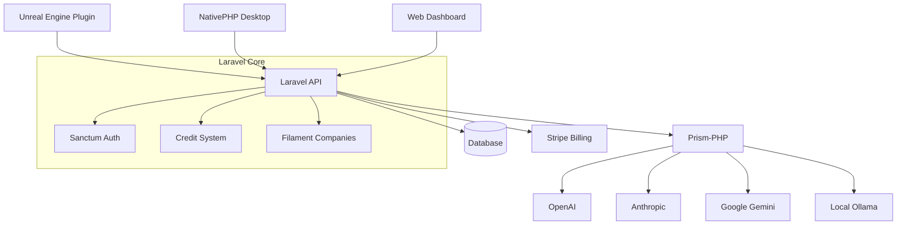
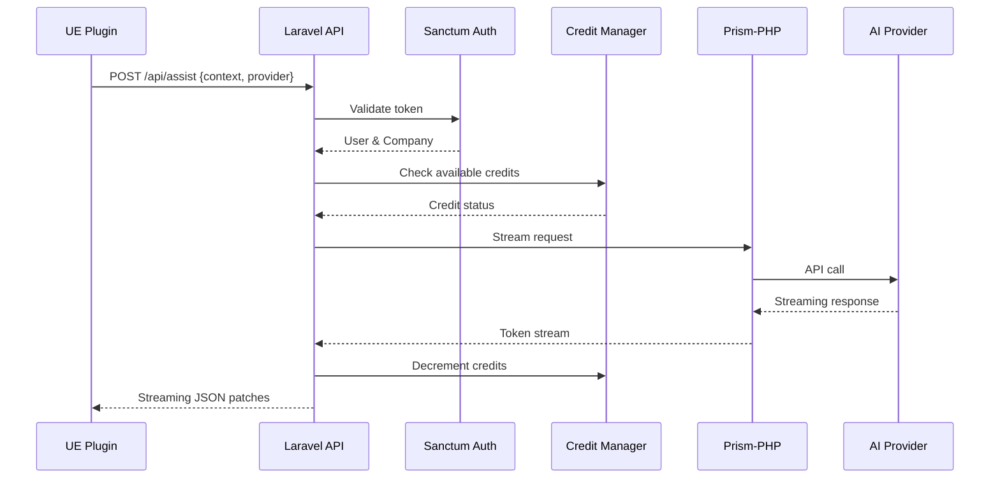

# Design Document

## Overview

SurrealPilot Bootstrap establishes the foundational architecture for an AI copilot system targeting Unreal Engine developers. The system leverages Laravel 12 with Filament 3 for the web interface, Filament Companies for multi-tenancy, and integrates multiple AI providers through Prism-PHP. The architecture supports both SaaS deployment and NativePHP desktop distribution, with a companion Unreal Engine plugin for seamless integration.

The core architecture follows a request-response pattern where UE plugin → Laravel API → LLM Provider → JSON response → UE applies changes, with comprehensive credit tracking, role-based access control, and streaming capabilities.

## Architecture

### High-Level System Architecture



### Request Flow Architecture



## Components and Interfaces

### 1. AI Provider Integration Layer

**Prism-PHP Configuration**
- Centralized configuration in `config/prism.php`
- Environment-based provider credentials
- Fallback logic for provider unavailability
- Token counting and rate limiting

**Provider Resolution Middleware**
```php
class ResolveAiDriver
{
    public function handle(Request $request, Closure $next)
    {
        $provider = $request->input('provider', 'openai');
        $company = $request->user()->currentCompany;
        
        // Resolve provider based on availability and company plan
        $resolvedProvider = $this->resolveProvider($provider, $company);
        $request->merge(['resolved_provider' => $resolvedProvider]);
        
        return $next($request);
    }
}
```

### 2. Credit Management System

**Database Schema Extensions**
```sql
-- Migration: add_credits_to_companies_table
ALTER TABLE companies ADD COLUMN credits INTEGER DEFAULT 0;
ALTER TABLE companies ADD COLUMN plan VARCHAR(50) DEFAULT 'starter';
ALTER TABLE companies ADD COLUMN monthly_credit_limit INTEGER DEFAULT 1000;

-- New table: credit_transactions
CREATE TABLE credit_transactions (
    id BIGINT PRIMARY KEY,
    company_id BIGINT REFERENCES companies(id),
    amount INTEGER NOT NULL,
    type ENUM('debit', 'credit'),
    description TEXT,
    metadata JSON,
    created_at TIMESTAMP
);
```

**Credit Manager Service**
```php
class CreditManager
{
    public function deductCredits(Company $company, int $tokens): bool
    public function addCredits(Company $company, int $amount, string $reason): void
    public function getUsageAnalytics(Company $company, Carbon $from, Carbon $to): array
    public function canAffordRequest(Company $company, int $estimatedTokens): bool
}
```

### 3. Streaming Chat API

**AssistController**
```php
class AssistController extends Controller
{
    public function chat(ChatRequest $request): StreamedResponse
    {
        return response()->stream(function () use ($request) {
            $prism = Prism::with($request->resolved_provider);
            
            foreach ($prism->stream($request->messages) as $chunk) {
                $this->creditManager->deductCredits(
                    $request->user()->currentCompany,
                    $chunk->tokenCount()
                );
                
                echo "data: " . json_encode($chunk->toArray()) . "\n\n";
                ob_flush();
                flush();
            }
        }, 200, [
            'Content-Type' => 'text/event-stream',
            'Cache-Control' => 'no-cache',
        ]);
    }
}
```

### 4. Filament Dashboard Integration

**Credit Widget**
```php
class CreditBalanceWidget extends BaseWidget
{
    protected static string $view = 'filament.widgets.credit-balance';
    
    public function getViewData(): array
    {
        $company = Filament::getTenant();
        return [
            'credits' => $company->credits,
            'plan' => $company->plan,
            'usage_this_month' => $this->getMonthlyUsage($company),
        ];
    }
}
```

**Usage Analytics Widget**
```php
class UsageAnalyticsWidget extends ChartWidget
{
    protected function getData(): array
    {
        $company = Filament::getTenant();
        return $this->creditManager->getUsageAnalytics($company, now()->subDays(30), now());
    }
}
```

### 5. NativePHP Desktop Application

**Native Bootstrap**
```php
// config/nativephp.php
return [
    'app_id' => 'com.surrealpilot.desktop',
    'app_name' => 'SurrealPilot',
    'window' => [
        'width' => 1200,
        'height' => 800,
        'resizable' => true,
    ],
    'serve' => [
        'port' => 8000,
        'host' => '127.0.0.1',
    ],
];
```

**Local Configuration Manager**
```php
class LocalConfigManager
{
    private string $configPath;
    
    public function __construct()
    {
        $this->configPath = $_SERVER['HOME'] . '/.surrealpilot/config.json';
    }
    
    public function getApiKeys(): array
    public function setApiKey(string $provider, string $key): void
    public function getPreferredProvider(): string
}
```

### 6. Unreal Engine Plugin Architecture

**Plugin Structure**
```
SurrealPilot/
├── Source/
│   ├── SurrealPilot/
│   │   ├── Private/
│   │   │   ├── SurrealPilotModule.cpp
│   │   │   ├── ContextExporter.cpp
│   │   │   ├── PatchApplier.cpp
│   │   │   └── HttpClient.cpp
│   │   └── Public/
│   │       ├── SurrealPilotModule.h
│   │       ├── ContextExporter.h
│   │       ├── PatchApplier.h
│   │       └── HttpClient.h
│   └── SurrealPilot.Build.cs
├── Config/
│   └── FilterPlugin.ini
└── SurrealPilot.uplugin
```

**Core Plugin Interfaces**
```cpp
class SURREALPILOT_API IContextExporter
{
public:
    virtual FString ExportBlueprintContext(UBlueprint* Blueprint) = 0;
    virtual FString ExportErrorContext(const TArray<FString>& Errors) = 0;
    virtual FString ExportSelectionContext() = 0;
};

class SURREALPILOT_API IPatchApplier
{
public:
    virtual bool ApplyJsonPatch(const FString& PatchJson) = 0;
    virtual bool CanApplyPatch(const FString& PatchJson) = 0;
};
```

## Data Models

### Extended Company Model
```php
class Company extends FilamentCompaniesCompany
{
    protected $fillable = [
        'name', 'personal_company', 'credits', 'plan', 'monthly_credit_limit'
    ];
    
    protected $casts = [
        'personal_company' => 'boolean',
        'credits' => 'integer',
        'monthly_credit_limit' => 'integer',
    ];
    
    public function creditTransactions(): HasMany
    public function canAffordTokens(int $tokens): bool
    public function getMonthlyUsage(): int
}
```

### Credit Transaction Model
```php
class CreditTransaction extends Model
{
    protected $fillable = [
        'company_id', 'amount', 'type', 'description', 'metadata'
    ];
    
    protected $casts = [
        'amount' => 'integer',
        'metadata' => 'array',
    ];
    
    public function company(): BelongsTo
}
```

### Subscription Plan Model
```php
class SubscriptionPlan extends Model
{
    protected $fillable = [
        'name', 'slug', 'monthly_credits', 'price_cents', 'stripe_price_id'
    ];
    
    protected $casts = [
        'monthly_credits' => 'integer',
        'price_cents' => 'integer',
    ];
}
```

## Error Handling

### API Error Responses
```php
class ApiErrorHandler
{
    public function handleInsufficientCredits(): JsonResponse
    {
        return response()->json([
            'error' => 'insufficient_credits',
            'message' => 'Company has insufficient credits for this request',
            'credits_available' => auth()->user()->currentCompany->credits,
        ], 402);
    }
    
    public function handleProviderError(Exception $e): JsonResponse
    {
        return response()->json([
            'error' => 'provider_error',
            'message' => 'AI provider temporarily unavailable',
            'fallback_providers' => $this->getAvailableProviders(),
        ], 503);
    }
}
```

### UE Plugin Error Handling
```cpp
class FSurrealPilotErrorHandler
{
public:
    static void HandleHttpError(int32 StatusCode, const FString& Response);
    static void HandlePatchError(const FString& PatchJson, const FString& Error);
    static void ShowUserNotification(const FString& Message, float Duration = 5.0f);
};
```

## Testing Strategy

### Unit Tests
- **Credit System**: Test credit deduction, addition, and validation logic
- **Provider Resolution**: Test fallback logic and provider selection
- **Token Counting**: Verify accurate token counting across providers
- **Permission Checks**: Validate role-based access control

### Integration Tests
- **API Endpoints**: Test complete request/response cycles
- **Streaming Responses**: Verify SSE functionality and credit deduction
- **Billing Integration**: Test Stripe webhook handling
- **Database Transactions**: Ensure data consistency

### UE Plugin Tests
- **Context Export**: Verify Blueprint and error context extraction
- **Patch Application**: Test JSON patch parsing and application
- **HTTP Communication**: Mock API responses and test error handling

### Performance Tests
- **Concurrent Requests**: Test system under load
- **Memory Usage**: Monitor streaming response memory consumption
- **Database Performance**: Optimize credit transaction queries

## Security Considerations

### API Security
- Sanctum token authentication for all endpoints
- Rate limiting per company and user
- Input validation and sanitization
- CORS configuration for desktop app

### Credit Security
- Atomic credit transactions to prevent race conditions
- Audit logging for all credit changes
- Fraud detection for unusual usage patterns
- Secure storage of provider API keys

### Desktop App Security
- Local config file encryption
- Secure API key storage
- Certificate pinning for API communication
- Auto-update security verification

## Deployment Architecture

### SaaS Deployment
- Laravel application on cloud infrastructure
- Redis for session and cache management
- PostgreSQL for primary database
- Stripe for payment processing
- CDN for static assets

### Desktop Distribution
- NativePHP Electron packaging
- Code signing for security
- Auto-update mechanism
- Offline capability with local Ollama

### Development Environment
- Docker containers for consistent development
- Automated testing pipeline
- Staging environment mirroring production
- Local Ollama setup for testing