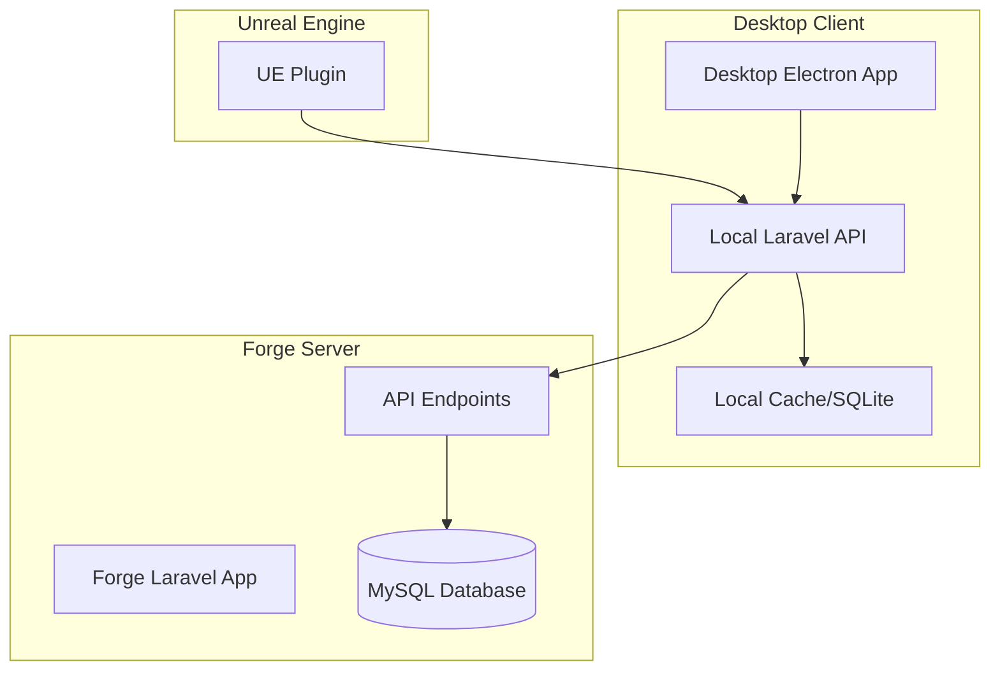

# SurrealPilot

<p align="center">
  
  
  
  
  
</p>

**SurrealPilot** is an AI copilot system designed specifically for Unreal Engine developers. It provides intelligent assistance through both web SaaS and desktop applications, integrating seamlessly with Unreal Engine through a custom plugin to process developer context and apply AI-generated fixes.

## 🚀 Features

### Core Functionality

-   **Engine Switcher**: Unreal Copilot and Web & Mobile games (PlayCanvas) from a single interface
-   **Multi-Provider AI Integration**: OpenAI, Anthropic, Gemini; optional local Ollama
-   **Streaming Chat API**: Real-time AI responses with SSE; per-chunk credit deductions
-   **Credit-Based Usage System**: Company-based credit management with plans and top-ups
-   **Role & Plan Gating**: Company-based plan capabilities (Unreal, Multiplayer, Advanced Publish, BYO keys)
-   **Unreal Engine Plugin**: Prompt-driven Blueprint/C++ edits with FScopedTransaction
-   **Web & Mobile (PlayCanvas)**: Headless MCP server per workspace for instant preview via iframe

### Deployment Options

-   **Web SaaS**: Marketing landing + app with React/Inertia interface
-   **Desktop Application**: NativePHP/Electron app with local status and chat
-   **Hybrid Architecture**: MCP per-workspace + SaaS API

### Developer Experience

-   **Context Export**: UE selection, logs; PlayCanvas scene JSON via MCP
-   **Patch Application**: AI-generated fixes applied directly (UE plugin / MCP)
-   **Instant Preview**: Live PlayCanvas preview reloads automatically after patches
-   **Local Configuration**: BYO provider keys (Studio), provider preferences
-   **Offline Capability**: Local Ollama integration

## 🏗️ Architecture

SurrealPilot uses a hybrid architecture supporting both web and desktop deployments:



## 📋 Requirements

### Server Requirements

-   PHP 8.3+
-   MySQL 8.0+ or PostgreSQL 13+
-   Redis 6.0+
-   Node.js 20+
-   Composer 2.0+

### Desktop Requirements

-   Windows 10+, macOS 10.15+, or Ubuntu 20.04+
-   4GB RAM minimum, 8GB recommended
-   2GB available disk space

### Unreal Engine Requirements

-   Unreal Engine 5.0+
-   C++ development tools
-   Blueprint development experience

## 🛠️ Installation

### Development Setup (Laragon)

1. **Clone the repository**

    ```bash
    git clone https://github.com/your-org/surrealpilot.git
    cd surrealpilot
    ```

2. **Install dependencies**

    ```bash
    composer install
    npm install
    ```

3. **Environment configuration**

    ```bash
    cp .env.example .env
    php artisan key:generate
    ```

4. **Database setup**

    ```bash
    php artisan migrate
    php artisan db:seed
    ```

5. **Build assets**

    ```bash
    npm run dev
    ```

6. **Start the application**
    ```bash
    php artisan serve
    ```

### Desktop Application Setup

1. **Install NativePHP dependencies**

    ```bash
    composer require nativephp/electron
    php artisan native:install
    ```

2. **Configure for desktop**

    ```bash
    # Update .env
    NATIVE_PHP_ENABLED=true
    NATIVE_PHP_PORT=8000
    ```

3. **Build desktop application**
    ```bash
    php artisan native:build
    ```

### Unreal Engine Plugin Installation

1. **Copy plugin to UE project**

    ```bash
    cp -r UnrealEngine/SurrealPilot /path/to/your/project/Plugins/
    ```

2. **Regenerate project files**

    ```bash
    # Right-click .uproject file and select "Generate Visual Studio project files"
    ```

3. **Build and enable plugin**
    - Open project in Unreal Engine
    - Go to Edit → Plugins
    - Find and enable "SurrealPilot"
    - Restart Unreal Engine

## 🔧 Configuration

### AI Orchestration (Vizra ADK)

Site-wide AI orchestration uses Vizra ADK (with Prism-PHP under the hood). Configure providers and defaults in `.env`:

```bash
# Vizra ADK defaults
VIZRA_ADK_DEFAULT_PROVIDER=anthropic
VIZRA_ADK_DEFAULT_MODEL=claude-sonnet-4-20250514
VIZRA_ADK_TRACING_ENABLED=true

# Engine-specific models used by app agents
AI_MODEL_PLAYCANVAS=claude-sonnet-4-20250514
AI_MODEL_UNREAL=claude-sonnet-4-20250514

# Providers (used by Vizra/Prism under the hood)
OPENAI_API_KEY=sk-...
ANTHROPIC_API_KEY=sk-ant-...
GEMINI_API_KEY=...
OLLAMA_BASE_URL=http://localhost:11434
```

### Billing Configuration

Set up Stripe for billing and subscriptions:

```bash
STRIPE_KEY=pk_test_...
STRIPE_SECRET=sk_test_...
STRIPE_WEBHOOK_SECRET=whsec_...
```

### Desktop Configuration

For desktop applications, configuration is stored in `~/.surrealpilot/config.json`:

```json
{
    "preferred_provider": "openai",
    "api_keys": {
        "openai": "sk-...",
        "anthropic": "sk-ant-..."
    },
    "saas_url": "https://surrealpilot.com",
    "saas_token": "..."
}
```

## 🧪 Testing

### Run Test Suite

```bash
# Full test suite
php artisan test

# Specific test categories
php artisan test --group=unit
php artisan test --group=feature
php artisan test --group=integration

# With coverage (requires Xdebug)
php artisan test --coverage
```

### Unreal Engine Plugin Tests

```bash
# Build and run C++ tests
cd UnrealEngine/SurrealPilot
# Use UE's testing framework or custom test runner
```

## 🚀 Deployment

### Production Deployment (Laravel Forge)

1. **Server setup**

    ```bash
    chmod +x scripts/setup-forge.sh
    ./scripts/setup-forge.sh
    ```

2. **Deploy application**

    ```bash
    chmod +x scripts/deploy-production.sh
    ./scripts/deploy-production.sh
    ```

3. **Post-deployment**
    ```bash
    chmod +x scripts/post-deploy.sh
    ./scripts/post-deploy.sh
    ```

### Desktop Distribution

1. **Build for all platforms**

    ```bash
    # Automated through GitHub Actions
    # See .github/workflows/desktop-release.yml
    ```

2. **Manual build**
    ```bash
    php artisan native:build --platform=win32
    php artisan native:build --platform=darwin
    php artisan native:build --platform=linux
    ```

## 📚 Documentation

-   [Local Configuration Guide](docs/local-configuration.md)
-   [Deployment Architecture](docs/deployment-architecture.md)
-   [Prism Configuration](docs/prism-configuration.md)
-   [API Documentation](docs/api.md)
-   [Plugin Development](UnrealEngine/SurrealPilot/README.md)

## 🏢 Implementation Status

### ✅ Completed Features

1. **Core Dependencies & Configuration**

    - Prism-PHP integration with multi-provider support
    - Cashier Billing Provider for Filament
    - NativePHP packages for desktop distribution

2. **Credit Management System**

    - Company-based credit tracking
    - Real-time credit deduction during API usage
    - Subscription plan management (Starter, Pro, Enterprise)
    - Credit transaction history and analytics

3. **AI Provider Integration**

    - OpenAI, Anthropic, Google Gemini, and Ollama support
    - Provider resolution middleware with fallback logic
    - Streaming responses with Server-Sent Events
    - Token counting and rate limiting

4. **API Endpoints**

    - `/api/assist` - Main chat endpoint with streaming support
    - `/api/desktop/*` - Desktop application configuration
    - Authentication via Sanctum tokens
    - Comprehensive error handling and monitoring

5. **Filament Dashboard**

    - Credit balance and usage analytics widgets
    - Credit top-up purchase integration
    - Billing history and subscription management
    - Company and user management

6. **Plan & Role Gating**

    - Company-based plan capabilities (Unreal, Multiplayer, Advanced Publish, BYO)
    - Middleware enforcement and UI CTAs

7. **NativePHP Desktop Application**

    - Electron-based desktop distribution
    - Local API server with port collision detection
    - Chat interface with streaming responses
    - Local configuration management

8. **Unreal Engine Plugin**

    - Blueprint JSON context export
    - Build error capture and formatting
    - Patch application system with FScopedTransaction
    - HTTP client for API communication
    - Settings and configuration management

9. **Billing Integration**

    - Stripe webhook processing
    - Automatic credit allocation on payments
    - Subscription status change handling
    - Billing history tracking

10. **Comprehensive Testing**

    - Unit tests for all service classes
    - Integration tests for API endpoints
    - Feature tests for credit system workflows
    - UE plugin unit tests

11. **Development & Deployment Configuration**
    - Environment configuration files
    - Deployment scripts for Laravel Forge
    - CI/CD pipeline with GitHub Actions
    - Desktop application build and distribution

### 🔄 Current Status

Core features implemented; finalizing UI polish, workspace sidebar, undo, and Stripe webhook mapping.

-   **Local Development**: Full Laragon setup with NativePHP desktop testing
-   **Staging Deployment**: Automated deployment to staging servers
-   **Production Deployment**: Laravel Forge deployment with monitoring
-   **Desktop Distribution**: Cross-platform Electron application builds

### 🎯 Next Steps

-   Workspace sidebar + template picker modal
-   Undo by patch_id (deterministic revert)
-   Stripe webhook mapping for plan/credits (test mode)
-   Gating CTAs, Sentry wiring
-   Docs (UE plugin guide, Web & Mobile workflow, Admin guides)

## 🤝 Contributing

We welcome contributions! Please see our [Contributing Guide](CONTRIBUTING.md) for details.

### Development Workflow

1. Fork the repository
2. Create a feature branch
3. Make your changes
4. Add tests for new functionality
5. Ensure all tests pass
6. Submit a pull request

### Code Standards

-   Follow PSR-12 coding standards
-   Write comprehensive tests
-   Document new features
-   Use conventional commit messages

## 📄 License

SurrealPilot is open-sourced software licensed under the [MIT license](LICENSE).

## 🆘 Support

-   **Documentation**: Check our [docs](docs/) directory
-   **Issues**: Report bugs on [GitHub Issues](https://github.com/your-org/surrealpilot/issues)
-   **Discussions**: Join our [GitHub Discussions](https://github.com/your-org/surrealpilot/discussions)
-   **Email**: Contact us at support@surrealpilot.com

## 🙏 Acknowledgments

-   **Laravel Team**: For the amazing framework
-   **Inertia.js Team**: For the seamless React integration
-   **NativePHP Team**: For desktop application capabilities
-   **Prism-PHP**: For multi-provider AI integration
-   **Epic Games**: For Unreal Engine and development tools

---

<p align="center">
  Made with ❤️ for the Unreal Engine developer community
</p>
