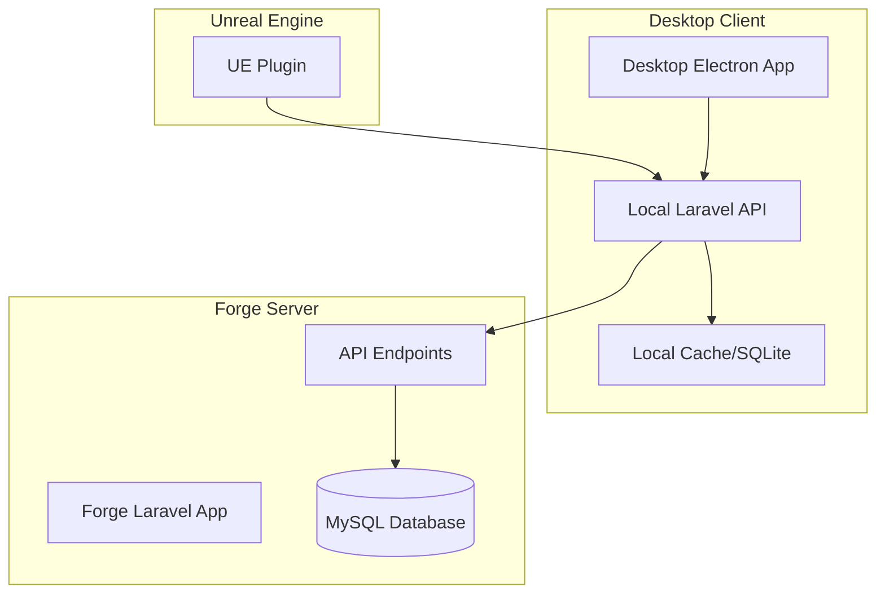

# SurrealPilot Deployment Architecture

## Overview

SurrealPilot uses a hybrid deployment architecture that supports both SaaS web deployment and NativePHP desktop distribution. The system is designed to maintain a centralized database and API while allowing desktop clients to connect seamlessly.

## Architecture Components

### 1. Web SaaS Deployment (Laravel Forge)

**Server Infrastructure:**
- Laravel application hosted on Forge servers
- MySQL database for centralized data storage
- Redis for caching and session management
- Nginx web server with SSL termination
- Supervisor for queue worker management

**Key Features:**
- Multi-tenant company management
- Centralized billing and subscription management
- Credit system with real-time tracking
- API endpoints for desktop client communication
- Filament admin dashboard

### 2. Desktop Application (NativePHP/Electron)

**Distribution Model:**
- Electron-based desktop application
- Self-contained Laravel application within Electron
- Local API server on configurable ports (8000, 8001, 8002, etc.)
- Connects to centralized Forge database for data synchronization

**Key Features:**
- Offline-capable with local Ollama integration
- Local configuration management (~/.surrealpilot/config.json)
- Automatic port collision detection and fallback
- Seamless integration with Unreal Engine plugin

## Database Architecture

### Centralized Database Strategy

The database remains centralized on the Forge server even for desktop clients. This approach provides several advantages:

**Benefits:**
1. **Data Consistency**: All users share the same data model and company information
2. **Billing Centralization**: Credit tracking and billing remain server-side
3. **Security**: Sensitive data like API keys and billing information stay secure
4. **Collaboration**: Team members can collaborate regardless of deployment method
5. **Analytics**: Centralized usage analytics and monitoring

**Implementation:**
- Desktop clients connect to Forge database via secure API endpoints
- Local SQLite database used only for caching and offline functionality
- Automatic synchronization when network connectivity is available

### Database Connection Flow



## Deployment Configurations

### Production Environment (Forge)

**Server Requirements:**
- PHP 8.3+ with required extensions
- MySQL 8.0+
- Redis 6.0+
- Node.js 20+ for asset compilation
- SSL certificate (Let's Encrypt)

**Environment Configuration:**
```bash
APP_ENV=production
DB_CONNECTION=mysql
DB_HOST=127.0.0.1
DB_DATABASE=surrealpilot_production
NATIVE_PHP_ENABLED=false
STRIPE_KEY=pk_live_...
```

### Desktop Development (Laragon)

**Local Development Setup:**
- Laragon for local PHP/MySQL environment
- NativePHP enabled for desktop testing
- Local Ollama instance for AI provider testing
- SQLite for local development database

**Environment Configuration:**
```bash
APP_ENV=local
DB_CONNECTION=sqlite
NATIVE_PHP_ENABLED=true
NATIVE_PHP_PORT=8000
STRIPE_KEY=pk_test_...
```

### Desktop Production Distribution

**Electron Package Configuration:**
- Bundled Laravel application with minimal dependencies
- Automatic database connection to production Forge server
- Local configuration management for user preferences
- Auto-update mechanism for application updates

**Environment Configuration:**
```bash
APP_ENV=desktop
DB_CONNECTION=mysql
DB_HOST=surrealpilot.com
DB_DATABASE=surrealpilot_production
NATIVE_PHP_ENABLED=true
NATIVE_PHP_PORT=8000
```

## Security Considerations

### API Authentication

**Desktop Client Authentication:**
- Sanctum tokens for API authentication
- Secure token storage in local configuration
- Automatic token refresh mechanism
- Rate limiting per client

### Database Security

**Connection Security:**
- SSL/TLS encryption for database connections
- VPN or secure tunneling for sensitive environments
- IP whitelisting for database access
- Regular security audits and updates

### Local Data Protection

**Desktop Client Security:**
- Encrypted local configuration files
- Secure API key storage
- Certificate pinning for API communication
- Automatic security updates

## Scaling Considerations

### Horizontal Scaling

**Web Application:**
- Load balancer for multiple Forge servers
- Database read replicas for improved performance
- Redis cluster for distributed caching
- CDN for static asset delivery

**Desktop Distribution:**
- Automatic update distribution
- Regional API endpoints for reduced latency
- Offline capability with local AI providers
- Bandwidth optimization for large updates

### Performance Optimization

**Database Performance:**
- Indexed queries for credit transactions
- Connection pooling for API endpoints
- Query optimization for real-time features
- Regular database maintenance and optimization

**API Performance:**
- Response caching for frequently accessed data
- Streaming responses for real-time features
- Rate limiting to prevent abuse
- Monitoring and alerting for performance issues

## Monitoring and Maintenance

### Application Monitoring

**Server Monitoring:**
- Application performance monitoring (APM)
- Database performance tracking
- Error logging and alerting
- Resource usage monitoring

**Desktop Client Monitoring:**
- Crash reporting and error tracking
- Usage analytics and feature adoption
- Performance metrics collection
- Update success/failure tracking

### Backup and Recovery

**Data Backup:**
- Daily automated database backups
- Application code and configuration backups
- Point-in-time recovery capabilities
- Disaster recovery procedures

**Update Management:**
- Staged deployment process
- Rollback capabilities for failed deployments
- Testing procedures for updates
- Communication plan for maintenance windows

## Deployment Workflow

### Continuous Integration/Deployment

1. **Development Phase:**
   - Local development with Laragon
   - Feature testing with NativePHP
   - Unit and integration testing

2. **Staging Deployment:**
   - Automated deployment to staging server
   - End-to-end testing with desktop clients
   - Performance and security testing

3. **Production Deployment:**
   - Blue-green deployment strategy
   - Database migration execution
   - Desktop client update distribution
   - Post-deployment verification

4. **Monitoring and Rollback:**
   - Real-time monitoring of deployment
   - Automatic rollback triggers
   - User communication and support
   - Post-deployment analysis and improvements

This architecture ensures that SurrealPilot can scale effectively while maintaining data consistency and security across both web and desktop deployments.